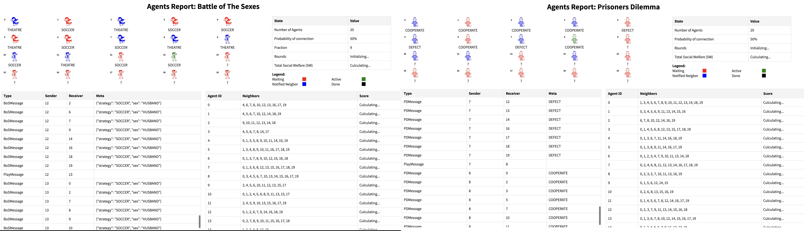
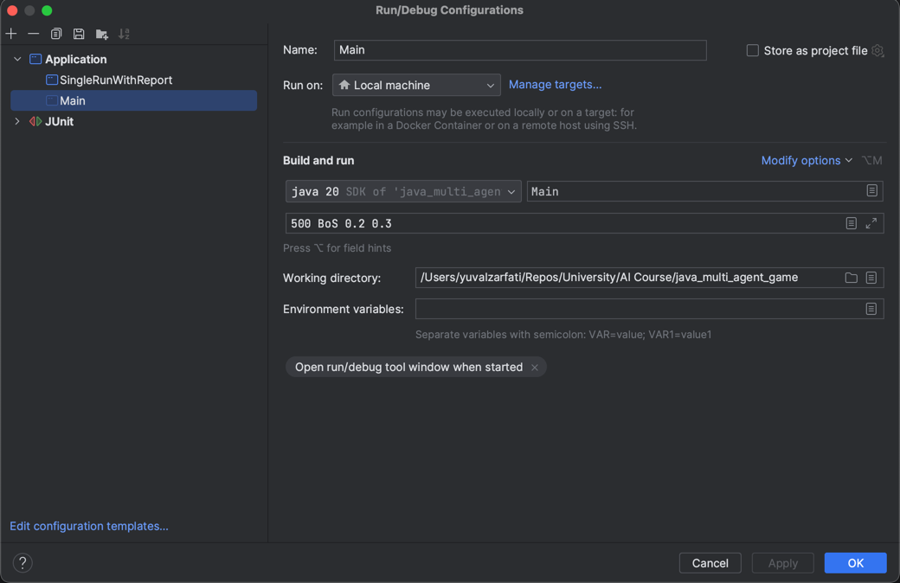

# Multi-Agent Games

- This project revolves around the concept of "Multi-Agent Games" on networks. Utilizing a multi-agent search approach, it focuses on solving two distinct types of simple games on Graph of Networks (GoNs). The games are characterized by their respective 2x2 matrices, serving as the foundation for the games among all pairs of neighboring agents. By integrating a distributed algorithm, the program efficiently simulates these games, ensuring dynamic interactions and outcomes based on agent strategies and decisions. The games are instantiated on randomly generated networks, emphasizing the adaptability and versatility of the solution approach.

- This project delves deep into the realm of "Multi-Agent Games" played on networks. Two prominent games, namely the Battle of the Sexes (BoS) and Prisoners' Dilemma (PD), take center stage in this endeavor.

  - **Battle of the Sexes (BoS)**: This game illustrates a situation where two players (often referred to as the 'husband' and 'wife') want to spend their evening together but have different preferences for activities. The payoff matrix is usually presented as:

    |               | Husband: Theater | Husband: Soccer |
    |---------------|------------------|-----------------|
    | Wife: Theater | (3, 1)           | (0, 0)          |
    | Wife: Soccer  | (0, 0)           | (1, 3)          |

    In the matrix, the first number in each tuple represents the husband's payoff, while the second number represents the wife's payoff.

  - **Prisoners' Dilemma (PD)**: This game is a classic representation of the conflict between individual and collective rationality. Two prisoners must decide whether to betray each other or stay silent. The standard payoff matrix is:

    |                       | Prisoner B: Defect | Prisoner B: Cooperate |
    |-----------------------|--------------------|-----------------------|
    | Prisoner A: Defect    | (5, 5)             | (10, 0)               |
    | Prisoner A: Cooperate | (0, 10)            | (8, 8)                |

    Here, higher values (less negative) are preferable. The first number in each tuple is Prisoner A's payoff, while the second is Prisoner B's payoff.

- Full assignment can be found [here](/static/assigment.pdf).
<br></br>


## Project Structure:

- 📁 **.github** - GitHub actions for automatic test (CI).
- 📁 **.idea** - IntelliJ project files.
- 📁 **reports** - HTML report template, and the folder that the temp reports are generated for.
- 📁 **src** - the actual Java code.
- 📁 **static** - a resource folder, mostly for the readme and the reports.
- 📁 **tests** - tests folder, with its own test data.
- 📁 **outputs** - example runs for assignment's inputs.
- 📄 **java_multi_agent_game.iml** - class path dependencies (for IntelliJ projects).
- 📄 **compile_and_run** - executes the main with argument, example [here](#usage).
- 📄 **java_multi_agent_game.iml** - class path dependencies (for IntelliJ projects).

## Features:

- **Agent Interactions**: Agents can communicate, share strategies, and make decisions based on the state of the game and the actions of other agents.
- **Network Generation**: Ability to generate agent networks based on specified probabilities.
- **Audit Logging**: Record and track all agent messages and decisions for verification and analysis.
- **Strategy Implementations**: Implement various game strategies like Prisoner's Dilemma and Battle of the Sexes.
- **Game Execution**: Simulate multiple rounds of games until agent strategies stabilize.
- **Exception Handling**: Handle various exceptions, such as invalid game settings or not providing enough arguments.
- **Report Generation**: Generates an HTML report for both "Battle of the Sexes (BoS)" and "Prisoners Dilemma (PD)".
- **Message Communication**: Ability for agents to send and receive various types of messages.
- **Testing**: Comprehensive unit tests for different parts of the project.
- **Settings**:
  - This project provides configurable settings to fine-tune its behavior and performance:
    - **DEBUG**: This flag controls the verbosity of the logging mechanism. When set to `true`, the program will output detailed logs, providing insights into the entire flow of a game during its runtime. Useful for debugging and understanding the application's inner workings.
    - **AGENT_SLEEP_TIME**: This setting defines the pause duration (in milliseconds) between each message an agent processes. By increasing this value, the program can be more CPU-friendly, reducing its consumption. However, it will also result in a longer completion time for the program. Setting it to `0` disables the sleep functionality, making agents process messages without any delay.

## Classes and Components:

- **Logger**: Manages logging functionalities.
- **GameExecutor**: Handles the game simulation's execution flow.
- **ReportMaker**: Responsible for generating reports.
- **AgentNetwork**: Represents the network of agents and their connections.
- **Audit**: Manages the recording of agent messages and decisions.
- **ArgsSerializer**: Handles serialization of game arguments.
- **Mailer**: Handles agent communication.
- **AgentFactory**: Provides factory methods to create agents.
- **GameArguments**: Holds the game simulation settings.
- **Agent**: Represents individual agents with unique strategies and decision-making capabilities.
- **NetworkGenerator**: Generates agent networks.
- **Main**: The main entry point of the application.
- **SingleRunWithReport**: Run game in a single iteration with an HTML report.
- **GameExecutorResults**: Contains the results of a game execution.
- **Various Messages**: Classes like `PDMessage`, `MailerMessage`, `PlayMessage`, `BoSMessage`, and others represent different types of messages exchanged between agents.
- **Enums**: Enums such as `GameType`, `BoSAgentSex`, `BoSStrategy`, and `PDStrategy` represent various categories and strategies in the simulation.
- **Interfaces and Records**: Components like `PBPayoff`, `BoSPayoff`, and `BoSNeighborData` help to define structured data and expected behaviors.
- **Settings**: Contains program settings, such as debug logs and agent sleep time.

## How This Works ?
1. **Initialization:**
    - Use the `Settings` class to configure general program settings, such as enabling/disabling debug logs or setting the agent sleep time.
    - The `Logger` class provides different logging functionalities. It allows you to log messages in various levels and colors to give clarity during program execution.

2. **Agent Network Generation:**
    - The `NetworkGenerator` is responsible for creating the Agent Network, which represents the interconnection of agents. This network defines how agents communicate and influence each other.

3. **Game Execution:**
    - The `GameExecutor` class manages the game's execution. All agents in the game run one by one in a turn-based fashion.
    - Agents follow an internal flow:
        1. **Read Messages:** Wait for a play message and read messages from neighbors using `readMessages()`.
        2. **Strategy Decision:** Based on the neighbors' decisions, they pick the best strategy using `pickStrategy()`.
        3. **Send Decision:** If the chosen strategy changes, agents send their decision to neighbors using `sendDecisionToNeighbors()`.
        4. **Trigger Next Agent:** After completing their turn, agents trigger the next agent using `triggerNextAgent()`.
    - If any issues arise during the game initialization or execution, custom exception classes like `NotEnoughArgumentsException` or `InvalidGameException` may be thrown.

4. **Multiple Game Runs:**
    - The `Main` class is the starting point of the application. It runs the game `NUMBER_OF_GAMES` times and then prints out the average results of these runs.

5. **Message Passing:**
    - Classes like `PDMessage`, `PlayMessage`, and `BoSMessage` are used for communication or status updates between different components of the application.

6. **Reporting and Auditing:**
    - Once the game is executed, you can generate detailed reports using the `ReportMaker` class.
    - The `Audit` class might be used to keep track of specific game events or results for accountability or analysis.

7. **Miscellaneous:**
    - The `Mailer` class can be used to send notifications or communication, possibly regarding game results or status updates.
    - The `ArgsSerializer` class helps in serializing arguments, useful for data interchange or storage.
    - The `SingleRunWithReport` class provides a way to execute the game for a single run and generate a corresponding report.

## Usage:

### Main Program:

- The Main program expects specified game arguments to run the simulation.

  #### In Intelij IDE:
- Click the green run arrow in `src/Main.java` with this config:
  

  #### In Eclipse IDE:

- Set up the run configuration to include the necessary game arguments.

  #### In shell (mac/ linux):

- Run:
  ```shell
  chmod +x compile_and_run.sh
  ```
- Then, run:
  ```shell
  ./compile_and_run.sh <number_of_agents:int> <probability_of_connection:float> <PD: gameType>
  ```
  or
  ```shell
  ./compile_and_run.sh <number_of_agents:int> <probability_of_connection:float> <BoS: gameType> <fraction:float>
  ```

### SingleRunWithReport Program:

- This program works the arguments [Main](#usage) does, it runs a single Game and generates an HTML report for it.

This project provides configurable settings to fine-tune its behavior and performance:

- **DEBUG**: This flag controls the verbosity of the logging mechanism. When set to `true`, the program will output detailed logs, providing insights into the entire flow of a game during its runtime. Useful for debugging and understanding the application's inner workings.

- **AGENT_SLEEP_TIME**: This setting defines the pause duration (in milliseconds) between each message an agent processes. By increasing this value, the program can be more CPU-friendly, reducing its consumption. However, it will also result in a longer completion time for the program. Setting it to `0` disables the sleep functionality, making agents process messages without any delay.

## Tests:

### **NetworkGeneratorTest**:
- `testGenerateNetwork`: Verifies the generation of an agent network with a specified probability and number of agents.
- `testGenerateNetworkWithZeroProbability`: Ensures the network generation with zero connection probability results in no agent connections.
- `testGenerateNetworkWithFullProbability`: Validates that a network with full connection probability connects all agents.
- `testGenerateNetworkWithLowProbabilityNoHoles`: insure that even with low probability AgentNetwork contains no holes.

### **AgentNetworkTest**:
- `testConnect`: Validates the connection between two agents in the network.
- `testLock`: Checks if the network is locked, preventing any new connections.
- `testAgentWithoutConnection`: Validate result when a network has no connection in a single Agent.
- `testAgentWithConnection`: Validate result when a network has a connection in a single Agent.
- `testMultipleAgentsSomeWithoutConnection`: Validate result when a network has mixed connections in a single Agent.

### **ArgsSerializerTest**:
- `testNoArguments`: Validates the behavior when no arguments are provided.
- `testTwoArguments`: Ensures correct behavior with two arguments.
- `testValidPDGameWithThreeArguments`: Validates a valid PD game setup with three arguments.
- `testInvalidBoSGameWithThreeArguments`: Checks for errors in an invalid BoS game setup with three arguments.
- `testValidBoSGameWithFourArguments`: Validates a valid BoS game setup with four arguments.
- `testInvalidGameType`: Ensures correct behavior with an invalid game type.

### **AgentFactoryTest**:
- `testCreatePDAgent`: Checks the creation of a PD Agent.
- `testCreateBoSAgent`: Validates the creation of a BoS Agent.
- `testInvalidGameType`: Ensures that an exception is thrown for an invalid game type.
- `testCreatePDAgents`: Validates the creation of multiple PD Agents.
- `testCreateBoSAgents`: Checks

### **TestPDAgent**:
- `testAgentStuckWithoutPlayMessage`: Validates that the agent does not send any message without receiving a `PlayMessage`.
- `testAgentRunsAndSendsMessageToNeighbor`: Confirms that upon receiving a `PlayMessage`, the agent sends its strategy to its neighbor.
- `testAgentDoesNotSentMessageTwice`: Ensures the agent does not send duplicate messages to its neighbor.
- `testAgentPicksDefectWhenNeighborCooperates`: Validates that the agent picks DEFECT when its neighbor chooses COOPERATE.
- `testAgentPicksDefectWhenNeighborDefects`: Confirms the agent sticks to DEFECT when its neighbor also defects.

### **TestBoSAgent**:
- `testAgentStuckWithoutPlayMessage`: Validates that the agent does not send any message without receiving a `PlayMessage`.
- `testAgentRunsAndSendsMessageToNeighbor`: Confirms that upon receiving a `PlayMessage`, the agent sends its strategy to its neighbor based on its assigned sex (HUSBAND/WIFE).
- `testAgentDoesNotSentMessageTwice`: Ensures the agent does not send duplicate messages to its neighbor.

### **BoSPayoffTest**:
- `testCalculatePayoff_Wife_BothSoccer`: Validates payoff calculation for both agents picking SOCCER with WIFE's perspective.
- `testCalculatePayoff_Husband_BothSoccer`: Validates payoff calculation for both agents picking SOCCER with HUSBAND's perspective.
- `testCalculatePayoff_Wife_DifferentChoices`: Checks the payoff when WIFE chooses SOCCER and HUSBAND chooses THEATRE.
- `testCalculatePayoff_Husband_DifferentChoices`: Checks the payoff when HUSBAND chooses THEATRE and WIFE chooses SOCCER.
- `testPickBestStrategy_AllWives_AllTheatre`: Determines best strategy for WIFE when all neighbors choose THEATRE.
- `testPickBestStrategy_AllHusbands_AllSoccer`: Determines best strategy for HUSBAND when all neighbors choose SOCCER.
- `testPickBestStrategy_HalfAndHalf_Wife_StartsTheatre`: Assesses strategy selection when half of the agents choose THEATRE and half choose SOCCER.

### **PDPayoffTest**:
- `testPickBestStrategyAllCooperate`: Determines best strategy when all agents cooperate.
- `testPickBestStrategyAllDefect`: Validates strategy selection when all agents defect.
- `testPickBestStrategyMixed`: Assesses strategy when agents have mixed decisions.
- `testCalculatePayoffBothCooperate`: Validates payoff when both agents cooperate.
- `testCalculatePayoffICooperateHeDefect`: Validates payoff when one agent cooperates and the other defects.
- `testCalculatePayoffIDefectHeCooperates`: Checks payoff when one agent defects and the other cooperates.
- `testCalculatePayoffBothDefect`: Validates payoff when both agents defect.
- `testPickBestStrategyNineCooperateOneDefect`: Determines best strategy with nine cooperators and one defector.
- `testPickBestStrategyFiveCooperateFiveDefect`: Assesses best strategy with equal number of cooperators and defectors.
- `testPickBestStrategyOneCooperateNineDefect`: Determines best strategy with one cooperator and nine defectors.
- `testPickBestStrategyEmptyMap`: Validates strategy selection with no neighbors' strategies.

## Github CI
- Check `.github/workflows/tests.yaml`.

## Notes:

- This project simulates various game strategies in a network of agents. Different agents can have different strategies and the aim is to see how strategies evolve over time based on agent interactions.

